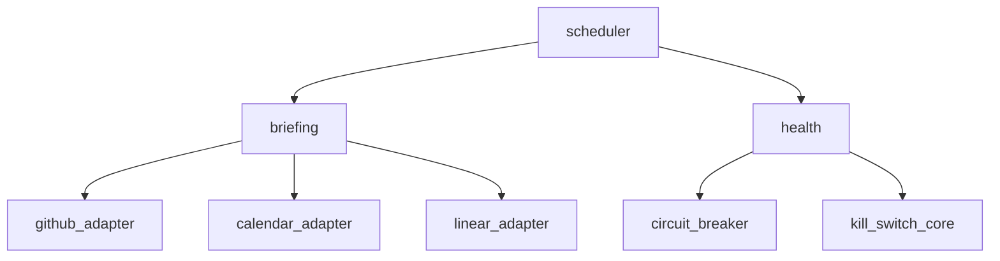
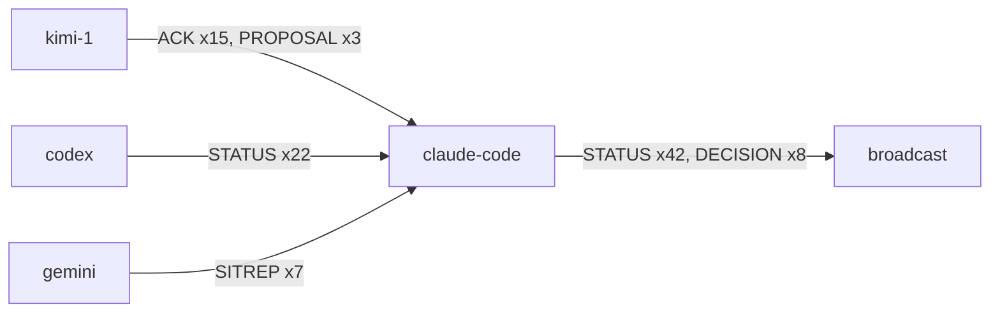

# Concept Map

Generate visual concept maps showing relationships between modules, classes, functions, or documents. Supports Python imports, markdown cross-references, and bus message flow patterns.

## Arguments

- `$ARGUMENTS` parsed as: `<source-path> [--format ascii|mermaid] [--depth N]`
- Default format: mermaid
- Default depth: 2 (how many levels of transitive dependencies to follow)
- Source can be: a Python file/directory, a markdown file, or "bus" for bus message flow

## Workflow

### 1. Python Import Graph

For a Python file or directory, extract imports and build a dependency graph.

```bash
# Extract all imports from a Python file or directory
python3 -c "
import ast, sys, pathlib

target = sys.argv[1]
p = pathlib.Path(target)
files = list(p.rglob('*.py')) if p.is_dir() else [p]

edges = []
for f in files:
    try:
        tree = ast.parse(f.read_text())
    except: continue
    module = str(f.with_suffix('')).replace('/', '.')
    for node in ast.walk(tree):
        if isinstance(node, ast.Import):
            for alias in node.names:
                edges.append((module, alias.name))
        elif isinstance(node, ast.ImportFrom):
            if node.module:
                edges.append((module, node.module))

for src, dst in sorted(set(edges)):
    print(f'{src}\t{dst}')
" TARGET_PATH
```

### 2. Markdown Link Graph

For markdown files, extract cross-references (relative links and section references).

```bash
# Extract links from markdown files
python3 -c "
import re, sys, pathlib

target = sys.argv[1]
p = pathlib.Path(target)
files = list(p.rglob('*.md')) if p.is_dir() else [p]

for f in files:
    text = f.read_text()
    links = re.findall(r'\[([^\]]+)\]\(([^)]+)\)', text)
    for label, href in links:
        if not href.startswith('http'):
            print(f'{f.name}\t{href}\t{label}')
" TARGET_PATH
```

### 3. Bus Message Flow

For bus analysis, map agent-to-agent communication patterns.

```bash
# Extract communication patterns from bus
awk -F'\t' 'NR>1 && $3 != "" {
  edge = $2 " -> " $3
  types[edge] = types[edge] ? types[edge] "," $4 : $4
  counts[edge]++
}
END {
  for (e in counts)
    printf "%s\t%d\t%s\n", e, counts[e], types[e]
}' _state/coordination/messages.tsv | sort -t$'\t' -k2 -rn
```

### 4. Render as Mermaid

Convert edges to Mermaid graph syntax.

```bash
python3 -c "
import sys

print('graph TD')
seen = set()
for line in sys.stdin:
    parts = line.strip().split('\t')
    if len(parts) >= 2:
        src, dst = parts[0], parts[1]
        src_id = src.replace('.', '_').replace('/', '_').replace(' ', '_')
        dst_id = dst.replace('.', '_').replace('/', '_').replace(' ', '_')
        label = parts[2] if len(parts) > 2 else ''
        edge_key = f'{src_id}_{dst_id}'
        if edge_key not in seen:
            seen.add(edge_key)
            if label:
                print(f'    {src_id}[\"{src}\"] -->|\"{label}\"| {dst_id}[\"{dst}\"]')
            else:
                print(f'    {src_id}[\"{src}\"] --> {dst_id}[\"{dst}\"]')
"
```

### 5. Render as ASCII

For terminal-friendly output without Mermaid rendering.

```bash
python3 -c "
import sys
from collections import defaultdict

children = defaultdict(list)
all_nodes = set()

for line in sys.stdin:
    parts = line.strip().split('\t')
    if len(parts) >= 2:
        src, dst = parts[0], parts[1]
        children[src].append(dst)
        all_nodes.add(src)
        all_nodes.add(dst)

# Find roots (nodes with no incoming edges)
dests = {d for ch in children.values() for d in ch}
roots = [n for n in all_nodes if n not in dests and n in children]
if not roots:
    roots = sorted(children.keys())[:3]

def draw(node, prefix='', is_last=True, visited=None):
    if visited is None: visited = set()
    connector = '└── ' if is_last else '├── '
    print(f'{prefix}{connector}{node}')
    if node in visited:
        print(f'{prefix}{\"    \" if is_last else \"│   \"}(circular)')
        return
    visited.add(node)
    kids = children.get(node, [])
    for i, kid in enumerate(kids):
        ext = '    ' if is_last else '│   '
        draw(kid, prefix + ext, i == len(kids)-1, visited.copy())

for i, root in enumerate(roots):
    if i > 0: print()
    draw(root, '', True)
"
```

## Output Format — Mermaid

````
Concept Map | [source path] | mermaid



## Stats
- Nodes: 7 | Edges: 7
- Max depth: 3 (scheduler -> briefing -> github_adapter)
- Hub nodes: briefing (3 outgoing), health (2 outgoing)
- Leaf nodes: github_adapter, calendar_adapter, linear_adapter, circuit_breaker, kill_switch_core

No further action needed.
````

## Output Format — ASCII

```
Concept Map | [source path] | ascii

└── scheduler
    ├── briefing
    │   ├── github_adapter
    │   ├── calendar_adapter
    │   └── linear_adapter
    └── health
        ├── circuit_breaker
        └── kill_switch_core

Stats: 7 nodes, 7 edges, max depth 3
Hub: briefing (3 deps) | Leaves: 5

No further action needed.
```

## Output Format — Bus Flow

````
Concept Map | bus message flow | mermaid



Top flows: claude->broadcast (50), kimi->claude (18), codex->claude (22)
````

## Depth Control

- `--depth 1`: Direct dependencies only
- `--depth 2`: Dependencies of dependencies (default)
- `--depth 3`: Three levels deep (can get noisy for large codebases)
- For directories with >50 files, automatically cap at depth 1 and note it

## Skill Chains

- After mapping: `[dependency-graph]` (if coupling looks high)
- After mapping: `[dead-code]` (if leaf nodes look unused)
- For onboarding: `[codebase-tour]` (narrative walkthrough)
- For architecture: `[arch-diagram]` (more formal diagram)
