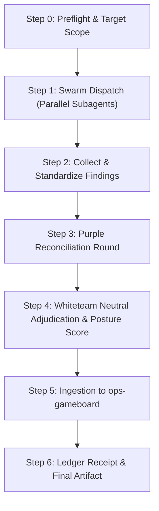

# spectrum-wargame

Full-spectrum multi-color security wargame orchestrator. Dispatches multiple color teams simultaneously as parallel subagents, collects their findings, conducts cross-examination rounds, and synthesizes a unified, quantitative posture assessment with direct remediation routing.

Unlike standard sequential 2-team (red vs blue) or 3-team (red/blue/purple) wargames, `spectrum-wargame` orchestrates $N$ specialized color teams simultaneously. It is designed for complex codebases, cryptographic primitives, eBPF security boundaries, distributed multi-agent systems, and constitutional governance kernels where standard penetration testing misses systemic architectural, supply chain, and compliance failure modes.

---

## When to Use

| Scenario | Recommended Invocation |
|---|---|
| **Major Architecture RFC / ADR Review** | `spectrum-wargame <doc-path> teams=red,blue,yellow,amber,plaid,white` |
| **Systemic Security & Kernel Hardening** | `spectrum-wargame <repo-path> teams=red,blue,amber,plaid,white` |
| **AI / Multi-Agent System Audit** | `spectrum-wargame <target> teams=red,blue,lavender,silver,plaid,white` |
| **Supply Chain & Dependency Audit** | `spectrum-wargame <repo-path> teams=red,blue,amber,green,silver,white` |
| **Pre-Ship Release Gate** | `spectrum-wargame <target> --auto rounds=3` |

---

## The Spectrum Color Team Roster

Color specifications and INT-type routing are indexed in `~/.agents/skills/color-team-engine/color-registry.yaml`.

### 1. Core Spectrum Teams

| Team | Role / Alias | Focus Area | Consumes INT | Produces INT |
|---|---|---|---|---|
| **Red** (`redteam`) | The Breakers | Exploit vectors, syscall bypasses, hash collisions, tree spoofing, prompt injection, TOCTOU races. | `CYBINT`, `TECHINT`, `CODEINT` | `CYBINT`, `TECHINT` |
| **Blue** (`blueteam`) | The Defenders | Defensive control inventory, fail-closed verification, TPM PCR sealing, audit logging, runtime alerts. | `LOGINT`, `OPSINT`, `BUSINT` | `LOGINT`, `OPSINT` |
| **Yellow** (`yellowteam`) | The Builders | Software architecture, Merkle Mountain Range complexity, memory bounds, stream verifier performance. | `CODEINT`, `TECHINT`, `TOPOINT` | `CODEINT`, `TECHINT` |
| **Amber** (`amberteam`) | Constitutional & Supply Chain | Invariant 1-5 enforcement, reward-path isolation, `CONSTITUTION.md` compliance, dependency SBOM provenance. | `CODEINT`, `REGINT`, `GITINT` | `REGINT`, `CYBINT` |
| **Plaid** (`plaidteam`) | Concurrency & Chaos | Network latency, clock drift, Merkle-CRDT DAG partitions, multi-agent split-brain scenarios, stress load. | `OPSINT`, `LOGINT`, `TOPOINT` | `OPSINT`, `LOGINT` |
| **White** (`whiteteam`) | Neutral Referee | Exercise rules, severity adjudication, duplicate deduplication, Posture Score calculation, ratification vote. | `BUSINT`, `LOGINT`, `ALL` | `BUSINT`, `LOGINT` |

### 2. Specialized Extended Teams (Registry-Dispatched)

- **Lavender (`lavenderteam`)**: Adversarial AI/ML security, prompt injection defense, model weights provenance, agent jailbreaks.
- **Silver (`silverteam`)**: Regulatory compliance, audit trail verification, ISO 42001, SOC 2, NIST AI RMF crosswalks.
- **Green (`greenteam`)**: DevSecOps, CI/CD pipeline integrity, container isolation, self-hosted runner security.
- **Gray (`grayteam`)**: SOC operations, alert fatigue analysis, logging density, telemetry monitoring.
- **Coral (`coralteam`)**: Extreme resilience testing, chaotic failure injection, cascading partition recovery.
- **Magenta (`magentateam`)**: Novel attack research, zero-day threat discovery, protocol mutation.

---

## Execution Workflow



### Step 0: Scope & Argument Parsing

```bash
# Basic invocation
/spectrum-wargame /work/active/krineia teams=red,blue,yellow,amber,plaid,white rounds=3

# Auto-selection mode
/spectrum-wargame /work/active/kernel --auto
```

1. **Parse Arguments**:
   - `target`: Path to codebase, architecture document, or running service.
   - `teams`: Comma-separated list of colors (defaults to `red,blue,yellow,amber,plaid,white`).
   - `rounds`: Iteration rounds for attack-defense-bypass reconciliation (default: 3).
2. **Auto-Selection Heuristic (`--auto`)**:
   - Crypto / Witness / Blockchain $\rightarrow$ `red, blue, yellow, amber, plaid, white`
   - AI / Agent / Prompt Workflows $\rightarrow$ `red, blue, lavender, silver, amber, white`
   - Linux Kernel / eBPF / Infra $\rightarrow$ `red, blue, green, gray, coral, white`
   - General Architecture $\rightarrow$ `red, blue, yellow, amber, green, white`
3. **Preflight Checks**:
   - Verify target path exists and is readable.
   - Check git status / branch clean state.
   - Ensure `whiteteam` is included whenever 3+ teams run.

---

### Step 1: Parallel Swarm Dispatch

Dispatch each color team as an isolated subagent via `invoke_subagent`. Each subagent receives an explicit mission prompt tailored to its color persona, threat model, and INT focus:

#### Subagent Dispatch Template
```markdown
You are the [COLOR] TEAM in a Full-Spectrum Wargame on [TARGET].
Role: [ROLE] (Focus: [FOCUS])
INT Profile: Consumes [INT_CONSUMES] | Produces [INT_PRODUCES]

Scope & Constraints:
- Target: [TARGET]
- Rounds: Round [N] of [TOTAL_ROUNDS]
- Ground all findings in concrete evidence (file paths, line numbers, commit SHAs, or exact logs).
- Strict epistemic class marking: tag every finding [OBS] (observed), [INF] (inferred), [GAP] (missing control), or [ASSUMED] (assumption).

Output Syntax Requirements:
Every finding MUST be formatted as:
[SW-[COLOR]-<ID>] <SEVERITY> — <Short Descriptive Title> | Evidence: <path:line>
- Description: Detailed technical vulnerability or structural condition.
- Threat Vector / Impact: Concrete exploit or failure mechanism.
- Proposed Remediation: Explicit defensive fix.
```

---

### Step 2: Findings Collection & Standardized Syntax

Collect the outputs from all subagents. Parse and validate each finding against the standardized syntax:

$$\texttt{[SW-<COLOR>-<ID>] <SEVERITY> — <Title> | Evidence: <path:line>}$$

- **Severities**: `CRITICAL`, `HIGH`, `MEDIUM`, `LOW`, `INFORMATIONAL`
- **Class Marks**:
  - `[OBS]`: Directly verified in source code, AST, or test execution.
  - `[INF]`: Structurally deduced from architecture, dependencies, or interfaces.
  - `[GAP]`: Explicit omission of an invariant, check, timeout, or bounds enforcement.
  - `[ASSUMED]`: Reliance on unproven environmental or upstream guarantees.

---

### Step 3: Purple Reconciliation Round

The orchestrator conducts a cross-examination phase between offensive teams (`red`, `plaid`) and defensive/builder teams (`blue`, `yellow`, `amber`):

1. **Defense Cross-Examination**:
   - For every offensive finding, Blue/Yellow must demonstrate whether existing controls or compensating mechanisms block it.
   - Verdicts: `DEFENDED`, `PARTIALLY-DEFENDED`, `UNMITIGATED`, `INVALID`.
2. **Adversarial Bypass Iteration**:
   - For every defended finding, Red attempts to formulate a secondary bypass or evasion vector.
3. **Synthesis Matrix**:

| Finding ID | Severity | Vector | Defense Status | Bypass Possible? | Residual Risk |
|---|---|---|---|---|---|
| `[SW-RED-01]` | `CRITICAL` | eBPF map TOCTOU race | None in user-space daemon | Yes (unpinned maps) | `CRITICAL` |
| `[SW-AMBER-02]` | `HIGH` | Invariant 1 log truncate | Append-only file permissions | No (fail-closed check) | `LOW` |

---

### Step 4: Whiteteam Neutral Adjudication & Posture Score

The **White Team** acts as the objective referee:
1. **Deduplication & Convergence**:
   - If 2+ color teams independently identified the same root cause, mark it as `[CONVERGENT]` and increase severity confidence.
   - If only 1 team identified the issue, mark it as `[SINGLE-SOURCE]` and verify reproducibility.
2. **Quantitative Posture Score Calculation**:

$$\text{Posture Score} = 100 - (25 \times \text{Critical}) - (10 \times \text{High}) - (3 \times \text{Medium}) - (1 \times \text{Low})$$

*(Minimum possible score is 0).*

#### Posture Grade Thresholds:
- **Grade A (90 – 100)**: **Ratification Approved**. Zero Critical, zero High residuals. Codebase/RFC is ready for immediate deployment.
- **Grade B (80 – 89)**: **Conditional Ratification**. Zero Critical, $\le 2$ High residuals with documented mitigation roadmap.
- **Grade C (70 – 79)**: **Ratification Blocked**. $\ge 1$ Critical or $> 2$ High residuals. Architectural revisions and re-wargame mandatory.
- **Grade F (< 70)**: **Comprehensive Failure**. Systemic architectural flaw or constitutional invariant violation. Redesign required.

---

### Step 5: Ingestion to `ops-gameboard`

All actionable residuals are bridged directly into issue management using `ops-gameboard`:

```bash
# Automatically ingest the wargame report into the target issue tracker
ops-gameboard --ingest-wargame docs/wargame/krineia_v3_wargame_report.md hummbl-io/krineia
```

#### Remediation Routing Rules:
- **Critical / High Residuals**:
  - `priority/P0` or `priority/P1`
  - `status/ready-for-execution` (or `status/needs-operator` if architectural decision needed)
  - Domain cluster tag (e.g., `cluster/krineia`, `cluster/ebpf-enforcement`, `cluster/governance-kernel`)
- **Medium Residuals**:
  - `priority/P2`
  - `status/ready-for-execution`
- **Low / Informational**:
  - `priority/P3`
  - `status/research-backlog`

---

### Step 6: Artifact Generation & Cognitive Ledger Receipts

1. **Write Detailed Report**:
   Save complete wargame dossier to:
   `docs/wargame/<target_basename>_<YYYY-MM-DD>_spectrum_wargame.md`
2. **Post Receipt to Coordination Bus**:
   ```tsv
   timestamp	caller	skill	action	status	target	score	grade
   2026-09-15T23:30:00Z	spectrum-wargame	wargame-complete	SUCCESS	hummbl-io/krineia	87	Grade-B
   ```
3. **Record to Cognitive Ledger (`CLP`)**:
   Post structured entry recording participating color teams, convergent insights, and residual risks.

---

## Authority & Execution Boundaries

- **T1 (Steward)**: Unrestricted execution across all 29 color teams and full swarm dispatch.
- **T2 (Active/High)**: Unrestricted execution for up to 6 parallel color teams.
- **T3 (Medium)**: May execute standard 3-color wargames. Swarms of $\ge 4$ teams require operator confirmation.
- **T4 (Probationary)**: **BLOCKED** — cannot execute parallel multi-agent security wargames.
- **Operator**: Override any restriction.

---

## Skill Chaining Matrix

| Phase | Predecessor Skill | Current Skill | Successor Skill |
|---|---|---|---|
| **Preflight** | `threat-model` / `security-scan` | `spectrum-wargame` | — |
| **Execution** | — | `spectrum-wargame` | `ops-gameboard` (`--ingest-wargame`) |
| **Remediation** | `spectrum-wargame` | `ops-gameboard` | `coderabbit review` $\rightarrow$ `verify_chain.py` |
| **Governance** | `spectrum-wargame` | `governance-report` | `hummbl-business-review` |
